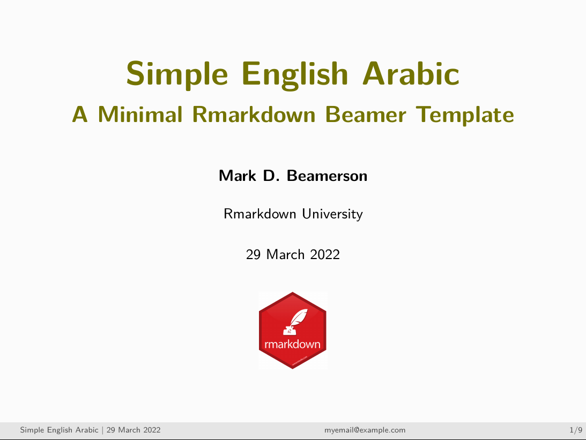
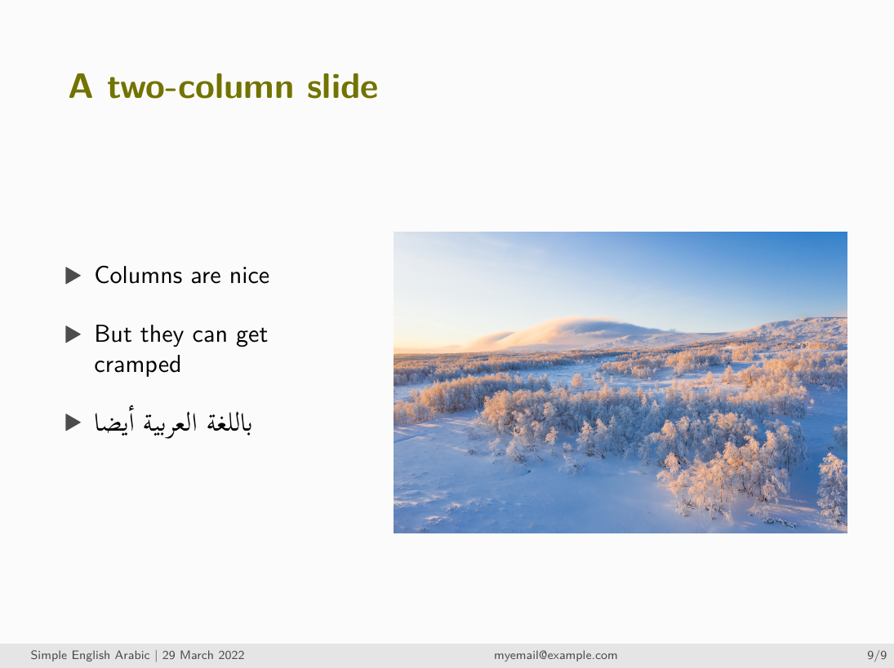

# SimEngAr: A simple Beamer template for slides with English and Arabic script

Mixing English and Arabic script in Beamer slides can be complicated. This
simple Beamer/RMarkdown template is aimed to make that task a little easier.

## Preview

## Use

1) Download `beamerthemeSimEngAr.sty` and `simple_english_arabic.Rmd` (or clone
the repository)
2) Edit the content of the `.Rmd` file to your needs.
3) Knit the `.Rmd`. Note that `beamerthemeSimEngAr.sty` must be accessible to R
by being either a) in the same folder as the `.Rmd` or b) in a folder below your
TeX home directory.

If you prefer a navigation sidebar instead of a navigation footer, follow the
instructions in the `.sty` file.
